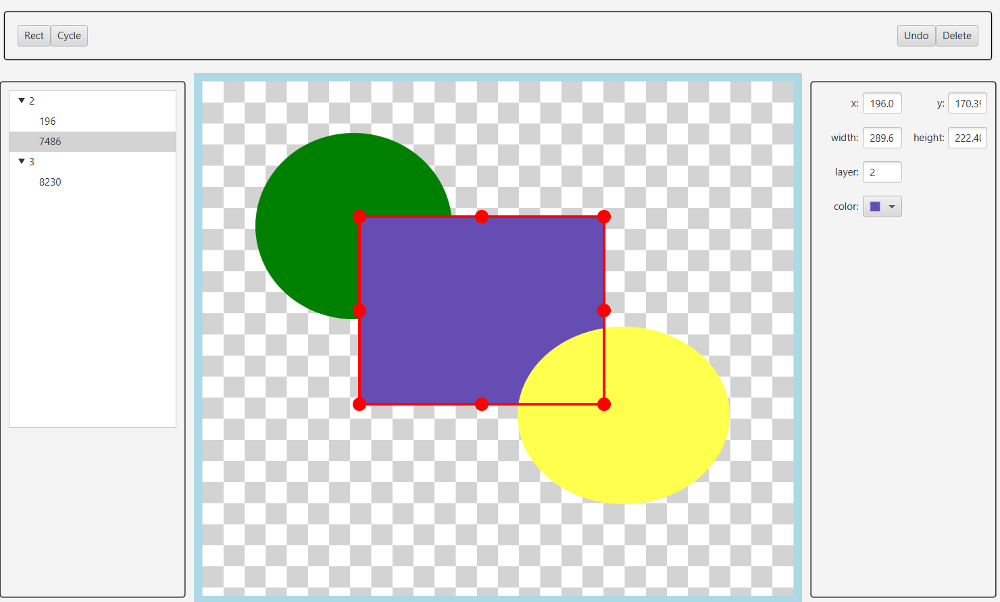
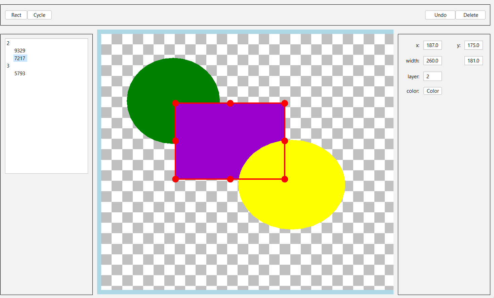

This repository is a technology- and architecture-focused project used as a **personal playground 
and investigation space**. I decided to open it to give reviewers a broader and more honest view of 
my technical level across different areas

The project is primarily intended for technical readers rather than as a showcase of end-user 
functionality as well as a specific library or predefined technology stack. 
Instead, it brings together multiple concepts within a *single, cohesive codebase*,
allowing the ideas to interact under more complex project rather than isolated examples. 

The GitHub version is kept *clean, buildable, and stable*, even though 
local development may include experiments and refactoring

> ⚠️ Some parts may appear overengineered by design - the focus is learning and validation rather 
> than end-user functionality.

#### 📄 Content
- [Application Overview](#application-overview)
- [Tech Stack](#tech-stack)
- [What This Project Demonstrates](#what-this-project-demonstrates)
- [Documentation & Navigation](#documentation--navigation)
- [Contacts](#contacts)

---

# Application Overview

From a user perspective, the application is a **simple graphical editor** that allows working  
with basic shapes on a canvas. Users can:
- draw rectangles and circles
- assign shapes to layers
- edit visual properties (position, size, color)
- interact via mouse or keyboard
- perform copy, paste and cut operations
- select multiple shapes holding 'ctrl' or switch between shapes under 
  the cursor by 'shift + right click'

Shapes are selectable, resizable, and draggable. The interface includes 
a property panel, layer's tree with a shape lists, and toolbar.

Applications support two platforms:

&emsp;**JavaFX**&emsp;&emsp;&emsp;&emsp;&emsp;&emsp;&emsp;&emsp;
&emsp;&emsp;&emsp;&emsp;&emsp;&emsp;&emsp;&emsp;&emsp;&emsp;
&emsp;&emsp;&emsp;&emsp;**Java Swing**

 

---

## Tech Stack

#### 💼 Project: Java, JavaFX, Java Swing, Google Guice, Logback, Maven, Lombock 
#### 📋 Tests: JUnit, Mockito, Cucumber, TestFX, Monocle, AssertJ, Cacio

---

## What This Project Demonstrates

### 🧱 Architecture & Design
- **Hexagonal (Ports & Adapters) architecture**
- [Events orchestration](documentation/architecture_overview.md#-event-level) 
  separated from business logic, avoiding UI-driven control flow
- Clear boundaries between [synchronous and asynchronous execution](documentation/architecture_overview.md#-thread-level) , 
  explicitly modeled and kept out of core logic

### 🏗️ Multi-platform UI architecture
- [Demonstrates how a single application architecture can target multiple GUI toolkits](documentation/gui_features.md#-gui-feature-multi-platform-ui-experiment) (*JavaFX* 
  and *Swing*) without UI embedding via JFXPanel or SwingNode, platform hacks, or duplicated business logic. The implementation 
  avoids element duplication - almost all components, including the canvas logic, are shared across platforms

### 🔌 Dependency Management
- **Dependency Injection (Guice)**, including [pre-initialization dependency setup](modules/realization/src/main/java/org/example/astero_demo/realization/initialization), 
  [test-specific configuration](modules/platform/javafx/src/test/java/org/example/astero_demo/func/module) etc
- **Strong modular separation, using Maven multi-module setup and JPMS**, with a clear distinction between:
  - platform-agnostic core logic
  - platform-specific implementations (JavaFX, Swing)

### 🎨 Canvas & Interaction Logic
- [Layered canvas architecture](documentation/gui_features.md#-canvas-layers), covering rendering, input handling, and interaction logic(mouse 
  events, drag & drop, tool-specific behavior), while keeping model state separate from visual concerns

### ⚙️ Application Behavior & Control
- A [Command Pattern](documentation/architecture_overview.md#-command-pattern--undo-support) implementation with undo support
- A [state machine–based approach](documentation/gui_features.md#-ui-modes--state-machine) to control application modes and UI behavior
- [Configuration](documentation/architecture_overview.md#-configuration) on startup
- **Fail-safe validation and defaulting**, keeping the system operational under partial or invalid input
- **Structured logging with markers**, aimed at tracing behavior across layers and threads
- [JavaFX controller and node builder factories](documentation/gui_features.md#-dependency-injection-in-javafx), used to decouple UI creation from application logic

### 🧪 Testing Strategy
The [testing strategy](documentation/testing_strategy.md) intentionally mixes multiple test types, each targeting a different level of the system:
- **Unit tests** — model logic, geometry, and pure computation
- **Integration tests** — interaction between components
- **Functional tests** — GUI behavior and user interactions, using *TestFX and 
  Monocle* for JavaFX, and *AssertJ and Cacio* for Swing, running the entire instance of 
  an application in headless mode

---

## Documentation & Navigation

To make this repository easier to explore, additional documentation is provided in the `/docs` directory.  
Each document focuses on a specific aspect of the project, such as:
- [module structure](documentation/module_structure.md)
- [architectural overview](documentation/architecture_overview.md)
- [GUI features](documentation/gui_features.md)
- [testing strategy](documentation/testing_strategy.md)
- [build and execution](documentation/build_and_execution.md)  

---

## Contacts

*klok0693@gmail.com*

*https://www.linkedin.com/in/pilip-yurchanka/*
